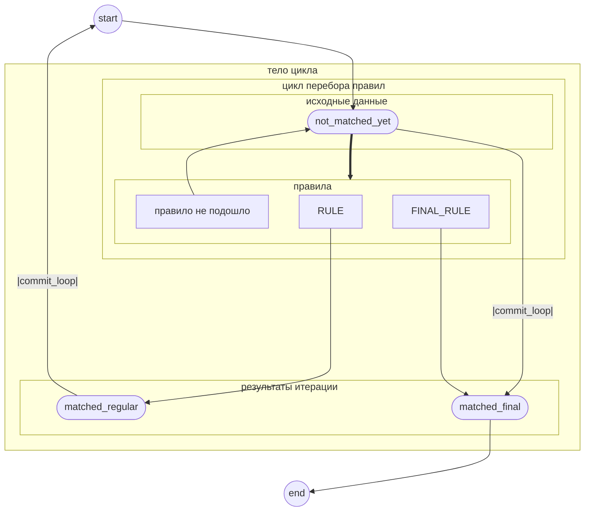
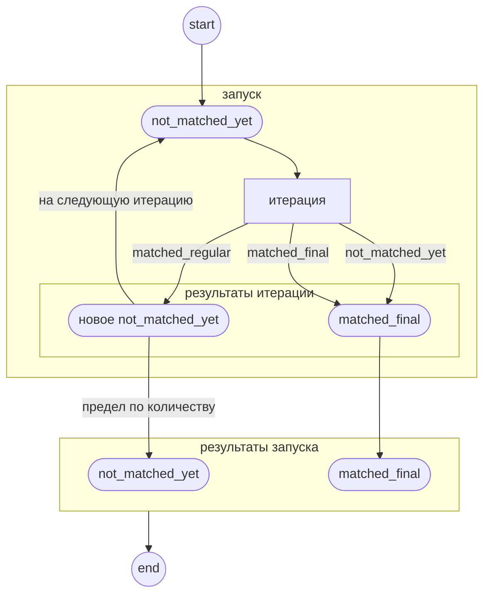

# Троичная монада

## Немножко корявого теорката

Удобно (и выгодно для компилятора) рассматривать НАМ-машину в категории RuleOutput с 3 объектами:

- `not_matched_yet <T>` - ещё не нашли совпадений (а возможно, и не начинали)
- `matched_regular <U>` - нашли совпадение и выполнили замену с помощью обычного правила
- `matched_final <U>`
  - ... с помощью финального правила,
  - либо УЖЕ не нашли совпадений и остановились, чтобы не зациклиться

где T и U - объекты из категории MachineData строк (обычных или с аугментацией).

Тогда правила, наборы альтернатив и весь цикл исполнения - это морфизмы из `not_matched_yet`

- обычное правило - в `not_matched_yet` или `matched_regular`
- финальное правило - в `not_matched_yet` или `matched_final`
- цикл - в `matched_final`

Кажется, что `matched_regular` - тупиковый объект, но нет, это внутренний объект цикла.

Если мы введём ещё морфизм(ы) "перезапуск цикла" (`commit_loop`), который определяет, что делать по итогам одной итерации:
- `not_matched_yet` - в `matched_final` (чтобы машина не зависла в бездействии)
- `matched_regular` - в `not_matched_yet` (уходим на следующую итерацию)
- `matched_final` - в `matched_final` (достигли финального состояния)

В принципе, можно отличать обычный финал от аварийного останова.
Добавить ещё одно состояние `matched_final_halted`, которое обрабатывается идентично
состоянию `matched_final`.

Ранее так и было сделано, но сейчас мне это кажется лишним усложнением и алогичностью,
поскольку тогда троичная монада содержит четыре объекта.

Если цикл прерван по достижению предельного времени работы - для НАМ-машины это
неестественное поведение, поэтому тут мы вольны делать что угодно.
Текущая реализация возвращает `not_matched_yet` (потому что так проще было написать).

## Схема переходов

### В одной итерации



### Запуск (с прерыванием по длительности)



## Как это всё работает

Для того, чтобы было меньше писанины, правила заданы морфизмами `MachineData -> RuleOutput`.

Потому что правила в принципе не могут получить на вход что-то помимо `not_matched_yet<MachineData>`.

Эндоморфизмом является операция `>> p` (где p - некое правило). Вот она уже принимает RuleOutput.

- из `not_matched_yet {v}` - в `p(v)`
- из всех остальных - в самих себя

## Получается монада

... очень похожая на Either, но с 3 вариантами.

```haskell
instance Monad Tristate where
    return i = not_matched_yet i

    (>>=) m k = case m of
        not_matched_yet i -> k i -- k :: x -> Tristate y
        otherwise         -> m

    (>>) m k = case m of
        not_matched_yet i -> k m -- k :: Tristate x -> Tristate y
        otherwise         -> m

-- перебор альтернатив

commit_alts m = m -- в хаскелле тривиально, но не в C++

rules [k1, k2, ..., kn] = \m -> commit_alts (m >> k1 >> k2 >> ... >> kn)
rules ks = \m -> commit_alts (foldl (>>) m ks)

-- тело цикла

commit_loop m = case m of
    not_matched_yet i -> matched_final i
    matched_regular o -> not_matched_yet o
    matched_final   o -> matched_final o

loop_body k = \m -> commit_loop (m >> k)

rule_loop k = \m -> m >> body >> body >> ... >> body >> the_loop
  where body     = loop_body k
        the_loop = rule_loop k
```

## А в чём выгода?

А в том, что ветвление функций `operator>>` и `commit_loop` зависит напрямую от тэга типа.

И в C++ перегрузки можно резолвить, просто сделав их членами классов.

Компилятору не нужно перебирать все доступные свободные функции или заниматься шаблонной магией.

## А почему не Either?

На самом деле, можно вместо Tristate сделать `Either (Either s s) s`

- `not_ready_yet i` == `Right i`
- `matched_regular r` == `Left (Right r)`
- `matched_final f` == `Left (Left f)`

Но опыты показали, что это создаёт очень большую нагрузку на компилятор.

Подробнее - [Эксперимент monadic](./monadic.md)

## Таблица свойств

| тип `T`            | `not_matched_yet`     | `matched_regular`     | `matched_final`       |
|--------------------|-----------------------|-----------------------|-----------------------|
| Either             | `Right input`         | `Left (Left temp)`    | `Left (Right final)`  |
| Си                 | `switch()...`         | `switch{ ... break;}` | `while(){... break;}` |
| временный?         | не обязательно        | да                    | да                    |
| создаётся          | перед итерацией       | в правиле             | в правиле             |
| `t >> p`           | `p(t)` : `T&&` / `U`  | `t` : `T&&`           | `t` : `T&&`           |
| `t.commit_alts()`  | `T&&` / `T const&`    | `t` : `T`             | `t` : `T`             |
| `t.commit_loop()`  | `matched_final`       | `not_matched_yet`     | `t` : `T`             |
